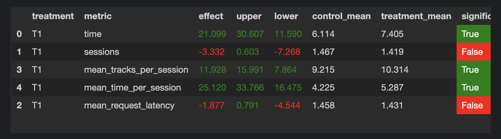

# Домашняя работа

## Рекомендер

За основу рекомендера был взят contextual рекомендер из семинара.
Было сделано два улучшения:
1. В качестве "запасного" рекомендера (который срабатывает в случае, если в CONTEXTUAL рекоменедре нет эмбединга для предыдущего трека)
был взят TopPop рекомендер (так как он показывает результаты лучше, чем обычный рекомендер).
2. Если время прослушивания предыдущего трека слишком мало, тогда в этом случае не стоит рекомендовать похожий трек, поэтому для таких случаев тоже включаетя TopPop рекомендер.
Треки с прослушиванием < 0.2 отправлялись в TopPop рекомендер.

Результаты:
Средня длина прослушивания нового рекомендера увеличилась на  25%. Улучшение является стат. значимым.

[Ссылка на Ноутбук](./jupyter/HM.ipynb).

# Установка и запуск.

Для устоновки нужно повторить начальные инструкции, в качестве интерпетатора использовался python 3.7.

Для запуска эксперимента нужно выполнить следующую команду:
~~~
python sim/run.py --episodes 1000 --config config/env.yml multi --processes 4
~~~